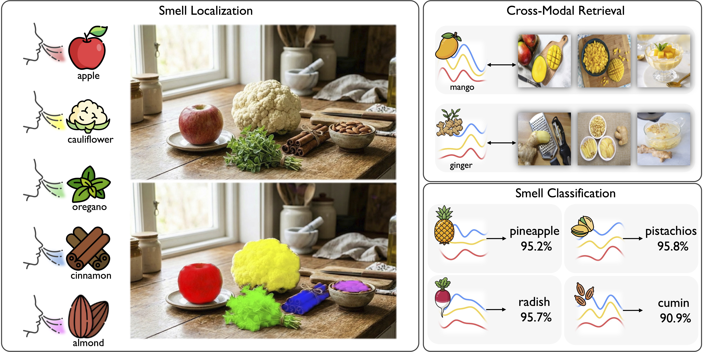

# See & Sniff: Learning Visuo-Olfactory Representations

<h3 align="center">ECCV 2026 (Oral)</h3>

The official Pytorch implementation for "See & Sniff: Learning Visuo-Olfactory Representations"
<br> [Seongyu Kim](https://seongyukim.github.io/), [Seungwoo Lee](https://sswwoo.github.io/), [Hyeonggon Ryu](https://sites.google.com/view/mmmi-hufs/members/pi?authuser=0), [Joon Son Chung](https://mm.kaist.ac.kr/joon/), [Arda Senocak](https://ardasnck.github.io/)

<!-- <p align="center">
  
</p> -->

<p align="center">
  <a href="https://mm.kaist.ac.kr/projects/SeeandSniff/"></a>&nbsp;
  <a href="https://arxiv.org/abs/2606.27307"></a>&nbsp;
  <a href="https://huggingface.co/sswwoo/SeeandSniff/tree/main"></a>
</p>

---

<p align="center">
  
</p>

---

## 1. Environment

```bash
# Create and activate conda environment
conda create -n seeandsniff python=3.10 -y
conda activate seeandsniff

# Install PyTorch
# The command below uses CUDA 11.8. Adjust the version according to your CUDA driver.
pip install torch==2.7.1+cu118 torchvision==0.22.1+cu118 torchaudio==2.7.1+cu118 --index-url https://download.pytorch.org/whl/cu118

# Install the remaining dependencies
pip install -r requirements.txt
```

## 2. Data Preparation

For dataset preparation and directory structure, please refer to [`datasets/README.md`](datasets/README.md).


## 3. Evaluation

#### Checkpoints
<table border="1">
  <tr>
    <td><b>Model</b></td>
    <td><b>Checkpoint</b></td>
  </tr>
  <tr>
    <td><code>Global-CLIP</code></td>
    <td><a href="https://huggingface.co/sswwoo/SeeandSniff/resolve/main/ckpt/Global-CLIP.pth">Global-CLIP.pth</a></td>
  </tr>
  <tr>
    <td><code>Ours-Global</code></td>
    <td><a href="https://huggingface.co/sswwoo/SeeandSniff/resolve/main/ckpt/Ours-Global.pth">Ours-Global.pth</a></td>
  </tr>
  <tr>
    <td><code>Ours-Local</code></td>
    <td><a href="https://huggingface.co/sswwoo/SeeandSniff/resolve/main/ckpt/Ours-Local.pth">Ours-Local.pth</a></td>
  </tr>
  <tr>
    <td><code>See & Sniff</code></td>
    <td><a href="https://huggingface.co/sswwoo/SeeandSniff/resolve/main/ckpt/SeeandSniff.pth">SeeandSniff.pth</a></td>
  </tr>
</table>


Place pretrained checkpoints under `outputs/` (e.g. `outputs/SeeandSniff.pth`). Each evaluation script reads training-time hyperparameters from the matching `--config` YAML, so configs and checkpoints must be paired (e.g. `outputs/Ours-Local.pth` ↔ `configs/Ours-Local.yaml`).

#### Smell Classification (Linear Probing)
```bash
bash scripts/linear_probing.sh
```

#### Smell Localization (mAP / mIoU)
```bash
bash scripts/localization.sh
```

#### Interactive Localization (IIoU)
```bash
bash scripts/localization_iiou.sh
```

## 4. Training
Clone the [DINOv3 repo](https://github.com/facebookresearch/dinov3?tab=readme-ov-file) into `ext_repos/dinov3/` and place the dinov3_vits16 checkpoint under `ext_repos/dinov3/ckpt_dinov3/`.
```bash
bash scripts/train.sh
```

Checkpoints, args, and logs are written to `outputs/<experiment_name>/`.


## 5. Citation

If you find this work useful, please cite it as:

```bibtex
@inproceedings{kim2026seeandsniff,
  author    = {Seongyu Kim and Seungwoo Lee and Hyeonggon Ryu and Joon Son Chung and Arda Senocak},
  title     = {See \& Sniff: Learning Visuo-Olfactory Representations},
  booktitle = {European Conference on Computer Vision},
  year      = {2026},
}
```

## 6. Acknowledgments

This work builds upon the olfactory dataset from [SmellNet](https://github.com/MIT-MI/SmellNet) (ICLR 2026). We thank the authors for their excellent work.